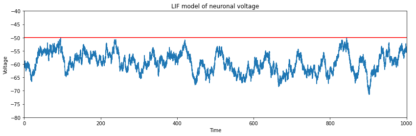

# An investigation into the LIF equation

The Leaky Integrate and Fire (LIF) model is a simple model of a neuron, which integrates the current through the dendrites and a leak term.

Throughout this investigation I tried to find the firing rate by simulating a neuron runnign the LIF and then I used approximations of the firing rate to test how accurate they were.

### A simulation of the LIF model:

### A comparison of the theoretical and simulated firing rates:

The approximation of the firing rates are only accurate in certain ranges. And in the middle segment the approximations break down.
